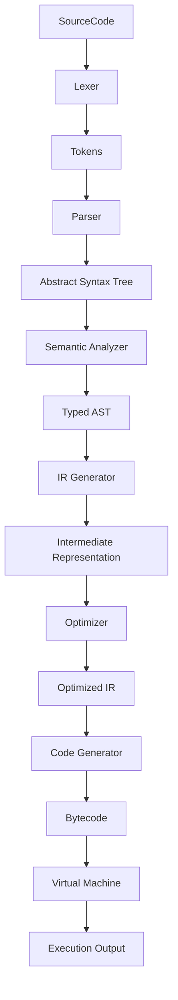

# Compiler Architecture

## Modules

### 1. Lexer
- **Input**: Source string
- **Output**: Stream of tokens
- **Responsibility**: Handles whitespace, comments, and tokenizes keywords, identifiers, literals, and operators.

### 2. Parser
- **Input**: Stream of tokens
- **Output**: Abstract Syntax Tree (AST)
- **Responsibility**: Validates syntax according to BNF grammar and builds the AST.
- **AST Nodes**:
    - `Program`: Root node containing a list of `FunctionDeclaration`.
    - `FunctionDeclaration`: Represents a function with name, parameters, return type, and body.
    - `Statement`: `LetStatement`, `ReturnStatement`, `IfStatement`, `WhileStatement`, `BlockStatement`, `ExpressionStatement`, `AssignmentStatement`.
    - `Expression`: `Identifier`, `IntegerLiteral`, `BooleanLiteral`, `PrefixExpression`, `InfixExpression`, `CallExpression`.

### 3. Semantic Analyzer
- **Input**: AST
- **Output**: Typed AST / Symbol Table
- **Responsibility**: Performs type checking, scope resolution, and validates semantics.
- **Symbol Table**: Tracks variable and function definitions, types, and scopes (global, function, block).
- **Checks**:
    - Variable declaration before use.
    - Type mismatches in assignments and expressions.
    - Function signature matching.

### 4. IR Generator
- **Input**: Typed AST
- **Output**: Linear IR (Instruction List)
- **Responsibility**: Translates AST into a linear list of instructions.
- **IR Structure**:
    - `OpCode`: `LOAD`, `STORE`, `ADD`, `SUB`, `JMP`, `JZ`, `CALL`, `RET`, etc.
    - `Instruction`: `{ op: OpCode, arg: value/label }`

### 5. Optimizer
- **Input**: IR
- **Output**: Optimized IR
- **Responsibility**: Performs optimizations on the IR.
- **Implemented Optimizations**:
    - **Constant Folding**: Evaluates constant expressions at compile time (e.g., `3 + 4` -> `7`).
    - **Dead Code Elimination**: Removes unreachable code (basic implementation).

### 6. Code Generator
- **Input**: Optimized IR
- **Output**: Bytecode (Instruction List)
- **Responsibility**: Prepares the IR for execution by the VM. In this implementation, it maps IR instructions directly to VM bytecode.

### 7. Virtual Machine (VM)
- **Input**: Bytecode
- **Output**: Execution result / Console Output
- **Responsibility**: Executes the bytecode in the browser.
- **Components**:
    - **Stack**: Used for arithmetic operations and function calls.
    - **Environment**: Stores variable values (Map<string, any>).
    - **Instruction Pointer (IP)**: Tracks current execution position.
    - **Execution Loop**: Fetches, decodes, and executes instructions.
